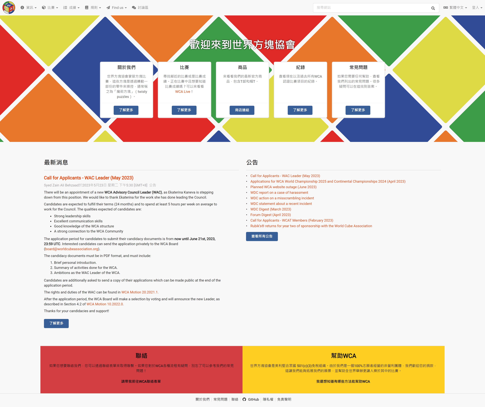
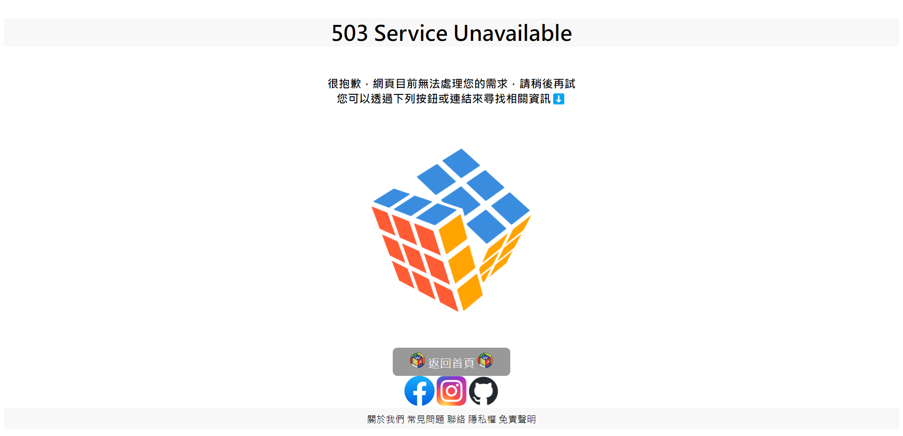
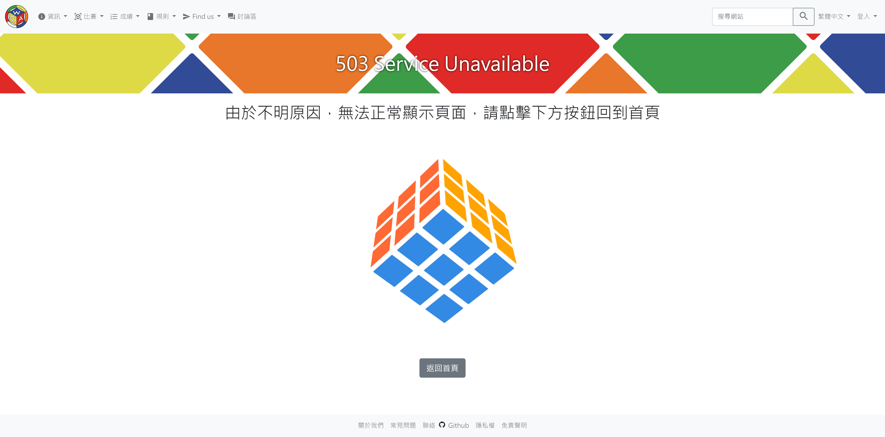
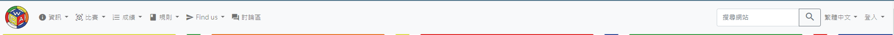
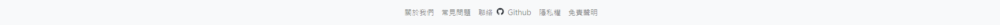
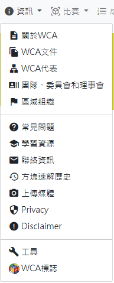
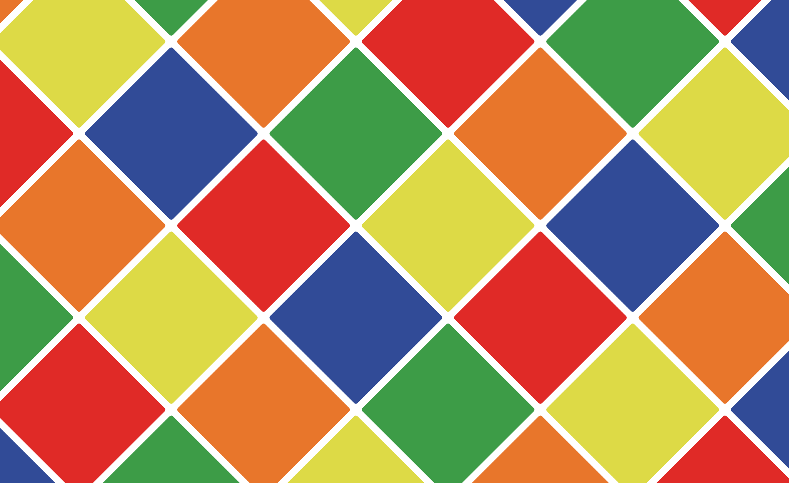
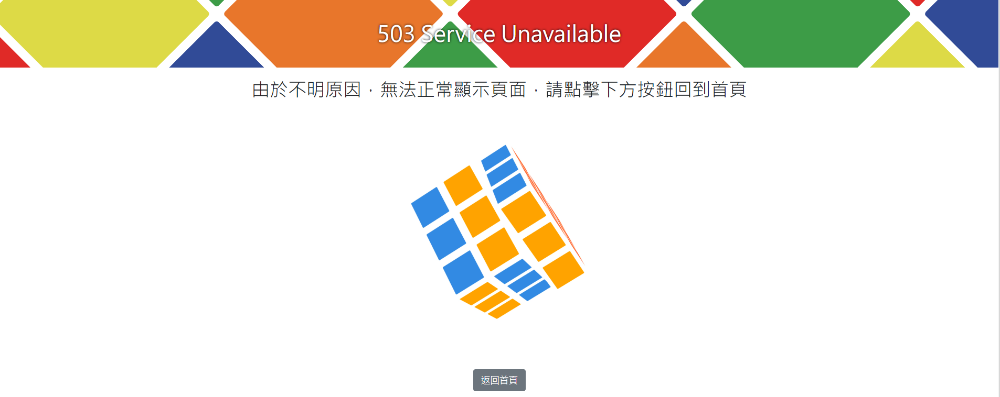
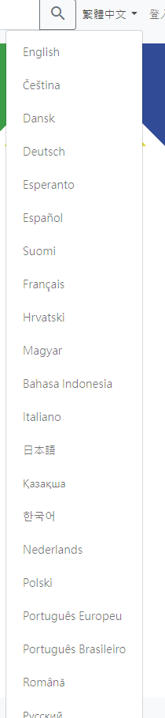
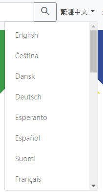

# web期末專題報告

`
姓名: 張牧翔
學號: D1035899
`

挑選加強作業: HW1

- 作業網站: [https://d1035899.github.io/final/](https://d1035899.github.io/final/)
- 挑選作業之網站: [https://d1035899.github.io/HW1/](https://d1035899.github.io/HW1/)
- Code Repo: [https://github.com/D1035899/final](https://github.com/D1035899/final)
- 挑選作業之repo: [https://github.com/D1035899/HW1](https://github.com/D1035899/HW1)
- 說明網站: [https://github.com/D1035899/final/blob/master/README.md](https://github.com/D1035899/HW3/blob/master/README.md)

---

## 目錄

- [web期末專題報告](#web期末專題報告)
  - [目錄](#目錄)
  - [選擇哪個作業當期末專題?](#選擇哪個作業當期末專題)
  - [差異 (加強前 / 後差異)](#差異-加強前--後差異)
    - [原官網](#原官網)
    - [加強前](#加強前)
    - [加強後](#加強後)
  - [加強後的網頁介紹](#加強後的網頁介紹)
    - [Header \& Footer](#header--footer)
    - [main content](#main-content)
  - [心得](#心得)

---

## 選擇哪個作業當期末專題?

這次期末專題選擇的是[「作業1 負評救星-當機等候網頁」](https://d1035899.github.io/HW1/)，原因是，當時做出來的網頁很粗糙，而且沒有跟原官網的風格完全符合，故想要將作業1的網頁做加強，透過bootstrap套件以及作業3所學到的復刻網站的相關手法，讓其可以成為該官網的當機網頁。
>雖然有提到作業3，但實際上只有抓官網的圖片來用而已，並沒有用到官網的code。

---

## 差異 (加強前 / 後差異)

此次報告重點會擺在加強後，加強前的介紹會稍微帶過，[如需檢閱作業1的的說明文檔請點此](https://github.com/D1035899/HW1/blob/master/README.md)。

### 原官網

此官網為作業1所選擇的目標網站，該網頁是由世界方塊協會所創立，其網頁內容有方塊教學、比賽紀錄等。

### 加強前

[作業1詳細介紹](https://github.com/D1035899/HW1/blob/master/README.md)

### 加強後

---

## 加強後的網頁介紹

### Header & Footer

首先網頁的上下方分別是`<header>`和`<footer>`，兩者均使用bootstrap的navbar來製作

*
Header
*

*
Footer
*

在`<header>`的navbar中有5個dropdown-menu，皆使用bootstrap的樣式，因為不知道原官網所使用的icon源自於那裏，所以只好使用google提供的[material icon](https://fonts.google.com/icons)中類似的圖示來顯示

*Dropdown-menu*

### main content

整個網頁的背景使用了原官網的背景圖作為底圖

*網頁底圖*

中間的白色區域是在`
`裡先加一個`
`並且在裡面加入bootstrap的`<container-fluid>`，後自己寫一個style.css，來生成一個白色的區域去覆蓋背景圖，並且在這個container裡加入錯誤訊息、gif以及按鈕，而白色區域上方的標題因為不在container裡，所以就會顯示網頁的背景圖，然後該標題的樣式我模仿了原官網的標題樣式，可以在style.css的`#main-message`看到。

*網頁主要內容*

在其中一個dropdown的過程發現因為dropdown的item太多，導致menu會超出頁面，故在該dropdown加入這段style`max-height: 345px; overflow-y: scroll`，`max-height`用來控制menu的長度，`overflow-y:scroll`用來讓該dropdown可以透過滾輪滾動清單

*溢出的menu*

*修復後的menu*

下方的灰色按鈕樣式也是使用bootstrap中的`.btn-secondary`，然後自己在main.js寫一個`function()`來讓該按鈕點擊時，導引用戶回到官網首頁。

---

## 心得

這次的期末專題原本想說沒什麼想法，不知道要選擇哪個作業來加強，後來想說不然就試試看把作業一、二的當機網頁修得像是官網一樣，順便練習使用bootstrap套件。bootstrap套件可以用的工具很多，基本上你想的到的他都有，還能抓下來做修改，自由度很高，不過我是直接link套件，然後遇到問題就查他的Documentation或是查StackOverFlow上有沒有相關的問題跟解決方案，並沒有使用chatGpt等ai輔助。

藉由這次的期末專題，我學到如何運用bootstrap套件來寫網頁，同時也覺得css真的很不好寫，bootstrap的css都有經過精心設計，讓使用者可以快速上手、快速運用，也不用煩惱排版不好排的問題。

這個學期以來，我學到如何使用HTML5、Node.js、VUE、SQL來寫網頁，雖然前後端都有學到，但我覺得我在後端的部分比較沒那麼上手，可能是因為前後端運用的東西不太一樣，讓我有點不太適應。我覺得如果在前端非常熟悉的狀況下在來學後端，應該會比前後端一起學的效果還要好，以後有機會的話，我會先把前端學好，再來學習後端以及兩者的交互運用。
